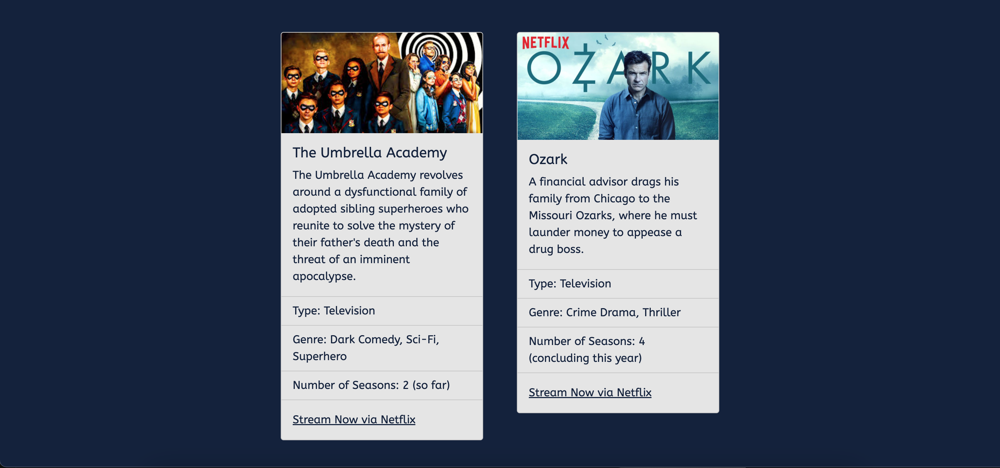

# Entertainment Page
What are some of your favorite books? Movies? TV Shows? Podcasts? Musicians? Are you always giving your friends recommendations (or looking for some yourself?) This page will serve as a one-stop-shop for all things entertainment!
## The Goal
Design a page that leverages Bootstrap components and the Bootstrap Grid system in an effective and purposeful way.
## The Lab
For this lab, you're starting with a basic HTML shell and a pre-linked stylesheet. **DON'T FORGET TO LINK [BOOTSTRAP'S CSS AND JS BUNDLES](https://getbootstrap.com/docs/5.0/getting-started/introduction/) BEFORE YOU START!** Keep reading for more details and specifications...
### Page One
For your first page, you'll be designing an entertainment hub homepage. Your homepage should include the following elements:
* Navbar
* Header Elements
* Carousel

While the content of your page is entirely at your discretion, the layout should match the mockup shown here. How were these elements added to the page using **grids**?

Note: Want to match the CSS customizations shown in the mockup? See style.css to determine what custom classes were created!

Additional Note: **!important** is included on several style elements in style.css to override Bootstrap-specific style for particular classes.

### Creating Additional HTML Files
We might not want to share all of our different recommendations on the same page. Instead, let's create multiple linked and functioning HTML pages, so each one can be used for a different type of recommendation!

Start by creating a new html file. We recommend naming your files based on what they're used for, so something like **moviestv.html** would be a good title for a page about movies & television!

When you create this new page, it'll have nothing on it. Start by copying over the entire contents of your **index.html** onto your new HTML file. Now you can begin to customize each page to include separate information.

The customized items in your **navbar** should link and function to connect any html pages you create. Make sure to change the **href** for each nav-item on your index.html file before copying the information over onto your new html file.

### Page Two
For your second page, use the following Bootstrap components, **once again laid out within a Bootstrap grid**, to share some recommendations. Your goal is to match the structure of the mockup, but again, customize to your heart's content!

Page Two should incorporate the following Bootstrap components:
* Navbar
* Dropdowns (Can be built into your Navbar)
* Cards

**HINT:** As you build out your page, think about making all elements of your page responsive, regardless of the window size your reader is using. Does your layout get messed up when you shrink the size of your window? If so, look into [gutters](https://getbootstrap.com/docs/5.0/layout/gutters/) on the Bootstrap website to think about formatting for a responsive design.

### Page Three
For your final page, you should use [BOOTSTRAP FORMS](https://getbootstrap.com/docs/5.0/forms/layout/) to create a suggestions page for your readers. Customize the elements of the form to your liking (the one shown here is just one example). When creating your form, consider some of the following:

* Layout
* Select
* Checks & Radios
* Buttons for User Interaction

